# ExpenseTrack

<p align="center">
  
</p>

ExpenseTrack es una aplicación móvil para Android que te ayuda a gestionar tus finanzas personales de manera sencilla y eficiente. Permite registrar transacciones de ingresos y gastos, organizar categorías, gestionar cuentas y visualizar tu historial financiero en un solo lugar.

## Tecnologías utilizadas

 - [**Ionic**](https://ionicframework.com/): Framework para desarrollo de aplicaciones multiplataforma e híbridas.

 - [**React**](https://es.react.dev/): Bibliotecas de JavaScript/TypeScript para construir la interfaz de usuario.

 - [**Firebase**](https://firebase.google.com/?hl=es-419): Plataforma backend para autenticación y almacenamiento de datos.

 - [**ExchangeRate-API**](https://www.exchangerate-api.com/): API para la conversión automática de saldo total a la divisa preferida del usuario.


## Características

 - Registrar transacciones de ingresos y gastos.

 - Crear y gestionar cuentas personales.

 - Transferencias entre cuentas y visualización del historial de transferencias.

 - Clasificar transacciones en categorías de tipo gasto o ingreso (por defecto o personalizadas).

 - Visualización de gasto mensual de una categoría deseada (presupuestos).

 - Distintos tipos de filtro (por cuenta, fecha, nombre, descripción).

 - Visualización del saldo total de todas las cuentas en la divisa preferida del usuario.

 - Estadísticas detalladas y gráficos sobre finanzas personales.

 - Exportación de historial de transacciones y transferencias a archivo excel.


## Instalación

### Para usuario

#### 1. Descarga el archivo APK desde la [sección de releases](https://github.com/PneumaCore/ExpenseTrack/releases).

#### 2. Activa la instalación desde fuentes desconocidas en tu dispositivo Android.

#### 3. Instala la aplicación.


### Para desarrolladores

#### 1. Clona el repositorio:

```

  git clone https://github.com/PneumaCore/ExpenseTrack.git

```

#### 2. Instala Ionic:

Antes de ejecutar la aplicación, deberás tener instalado [Node.js](https://nodejs.org/es/download) en tu equipo. Una vez hecho esto, instala el cliente de Ionic con el siguiente comando:

```

  npm install -g @ionic/cli

```

#### 3. Instala las dependencias:

Navega al directorio de la aplicación y ejecuta el siguiente comando para instalar todas las dependencias:

```

  cd ExpenseTrack
  npm install

```


#### 4. Configurar Firebase:

Para conectar la aplicación con Firebase, necesitarás las claves API de tu proyecto de Firebase. Sigue estos pasos para obtenerlas:

#### - Regístrate o inicia sesión en [Firebase](https://firebase.google.com/?hl=es-419).

#### - Crea un nuevo proyecto llamado ExpenseTrack en [Firebase Console](https://console.firebase.google.com/u/0/?hl=es-419).

#### - En la pantalla principal del proyecto, en el apartado para agregar Firebase a tu app, pulsa en 'Web', con esto, generarás las claves API.

#### - Ahora, crea un archivo '.env' en el directorio raíz de la aplicación y agrega las claves API generadas de la siguiente forma:

```

  VITE_APP_API_KEY=tu_clave_api
  VITE_APP_AUTH_DOMAIN=tu_clave_auth_domain
  VITE_APP_PROJECT_ID=tu_clave_project_id
  VITE_APP_STORAGE_BUCKET=tu_clave_storage_bucket
  VITE_APP_MESSAGING_SENDER_ID=tu_clave_messaging_sender
  VITE_APP_APP_ID=tu_clave_app_id

```

#### 5. Crear colecciones en Cloud Firestore:

Además de las claves, necesitarás las colecciones de la base de datos que se manejan en la aplicación, para ello, vuelve nuevamente a la pantalla principal del proyecto de Firebase. Pulsa en 'Todos los productos' y busca en la lista 'Cloud Firestore' y pulsa en 'Crear base de datos'. Selecciona un servidor europeo e inicia la base de datos en modo de producción. A continuación, deberás crear las siugientes colecciones:

#### - Colección 'users':

Almacena los datos del usuario.

```

  {
    user_id: Cadena,
    profile_photo: Cadena,
    name: Cadena,
    surname_1: Cadena,
    surname_2: Cadena,
    currency: Cadena,
    isAccountSetup: Boleano
  }

```

#### - Colección 'accounts':

Almacena las cuentas personales del usuario.

```

  {
    account_id: Cadena,
    user_id: Cadena,
    name: Cadena,
    currency: Cadena,
    balance: Número,
    icon: Cadena,
    color: Cadena
  }

```

#### - Colección 'categories':

Almacena las categorías por defecto y las personalizadas por el usuario.

```

  {
    category_id: Cadena,
    user_id: Cadena,
    name: Cadena,
    mensualBudget: Número,
    type: Cadena,
    icon: Cadena,
    color: Cadena
  }

```

#### - Colección 'transactions':

Almacena las transacciones realizadas por el usuario.

```

  {
    transaction_id: Cadena,
    user_id: Cadena,
    type: Cadena,
    category_id: Cadena,
    account_id: Cadena,
    amount: Número,
    currency: Cadena,
    date: Marca de tiempo,
    note: Cadena,
    image: Array
  }

```

#### - Colección 'recurringTransactios':

Almacena las transacciones recurrentes programadas por del usuario.

```

  {
    recurring_transaction_id: Cadena,
    user_id: Cadena,
    type: Cadena,
    name: Cadena,
    category_id: Cadena,
    account_id: Cadena,
    amount: Número,
    currency: Cadena,
    date: Marca de tiempo,
    frequency: Cadena,
    next_execution: Marca de tiempo
  }

```

#### - Colección 'transfers':

Almacena las transferencias entre cuentas realizadas por del usuario.

```

  {
    transfer_id: Cadena,
    user_id: Cadena,
    source_account_id: Cadena,
    destination_account_id: Cadena,
    amount: Número,
    converted_amount: Número,
    source_currency: Cadena,
    destination_currency: Cadena,
    date: Marca de tiempo,
    note: Cadena
  }

```

#### 6. Ejecuta la aplicación:

```

  ionic serve

```


## Capturas de pantalla

#### Pantalla de inicio de sesión

<p align="center">
  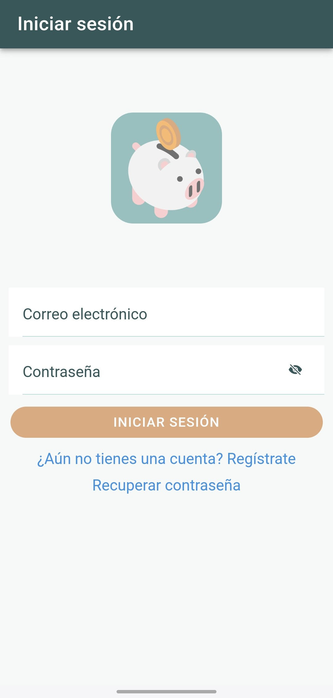
</p>

#### Pantalla de bienvenida al iniciar sesión por primera vez

<p align="center">
  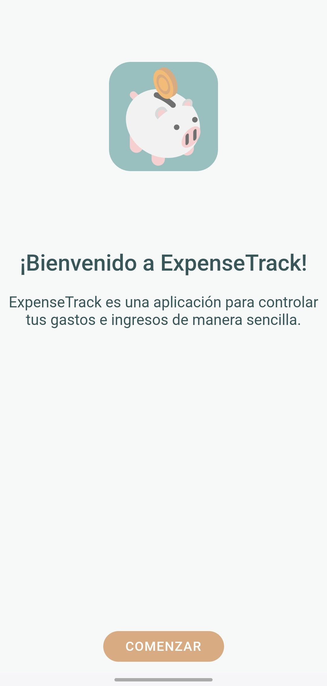
</p>

#### Pantalla de inicio

<p align="center">
  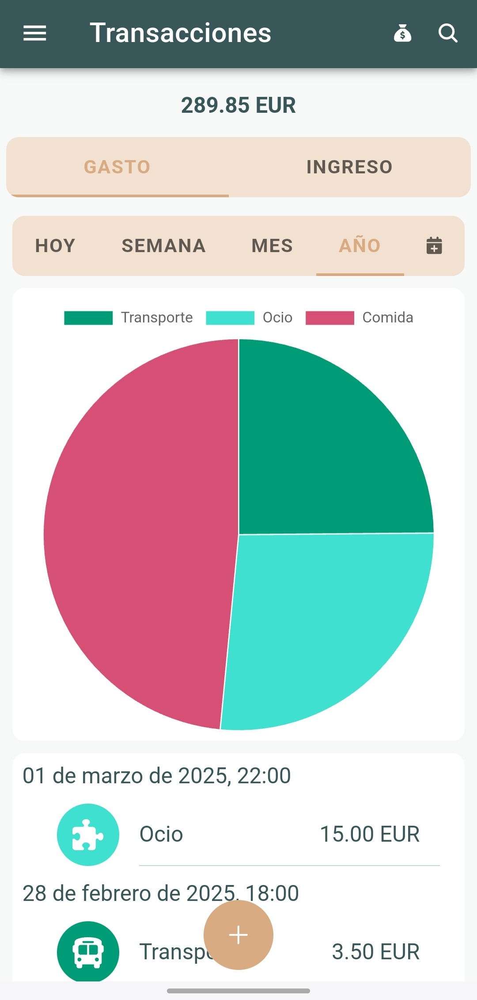
</p>

#### Menú para añadir transferencias

<p align="center">
  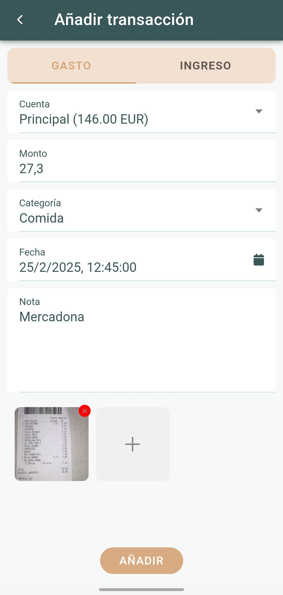
</p>

#### Menú lateral desplegable y sus opciones

<p align="center">
  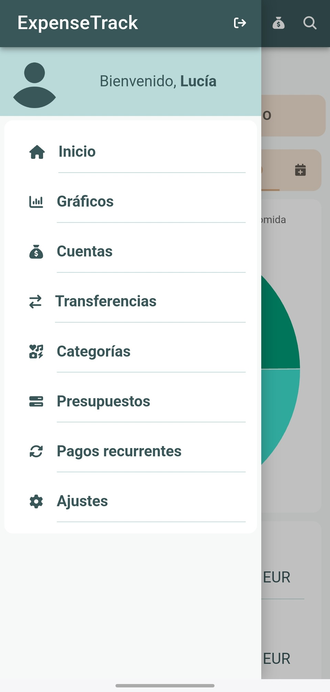
</p>

#### Pantalla de cuentas

<p align="center">
  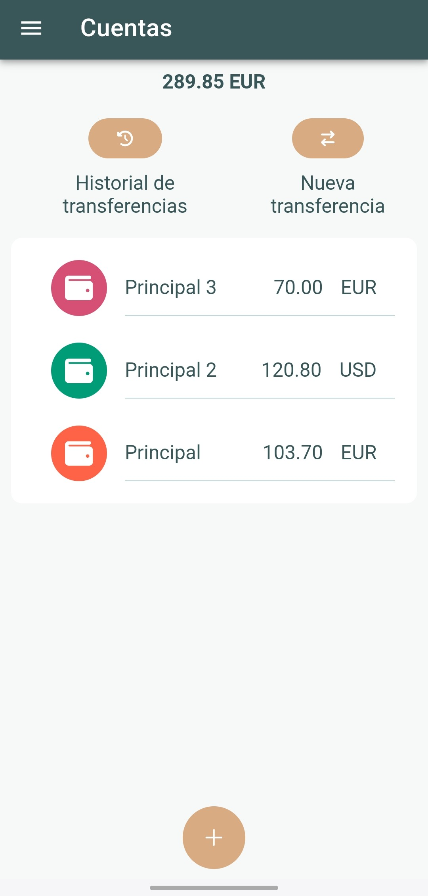
</p>

#### Pantalla de transferencias

<p align="center">
  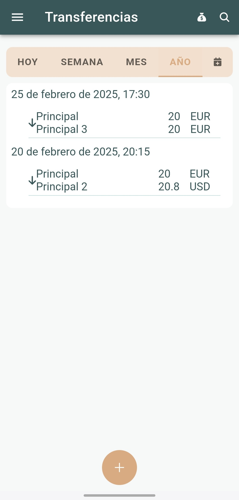
</p>

#### Pantalla de categorías

<p align="center">
  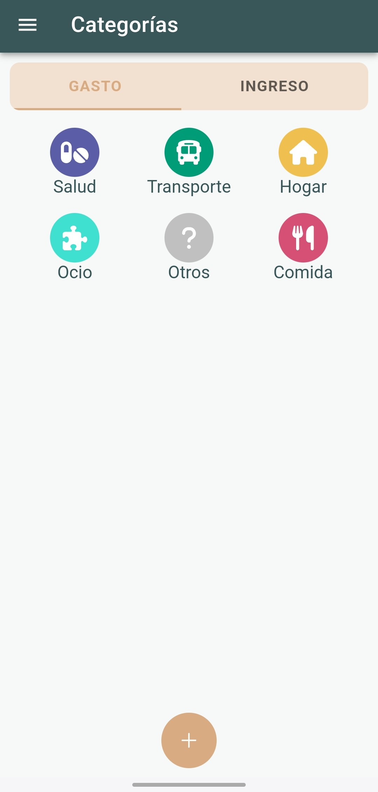
</p>

#### Pantalla de presupuestos

<p align="center">
  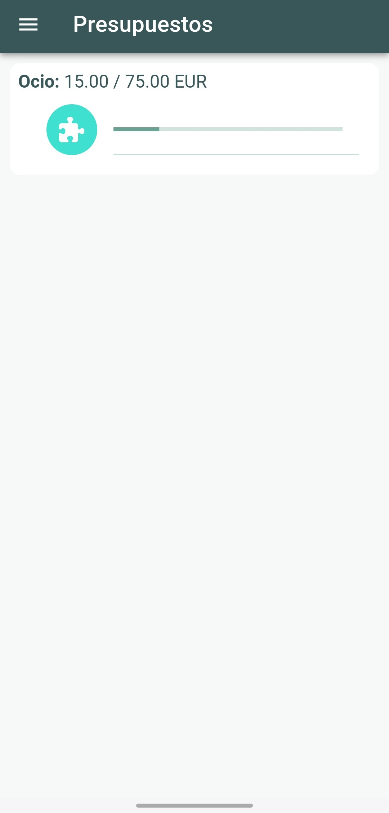
</p>

#### Pantalla de transacciones recurrentes

<p align="center">
  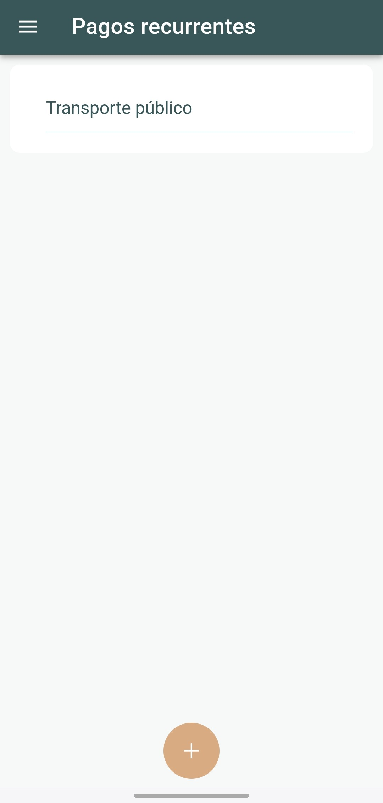
</p>

#### Pantalla de ajustes y sus opciones

<p align="center">
  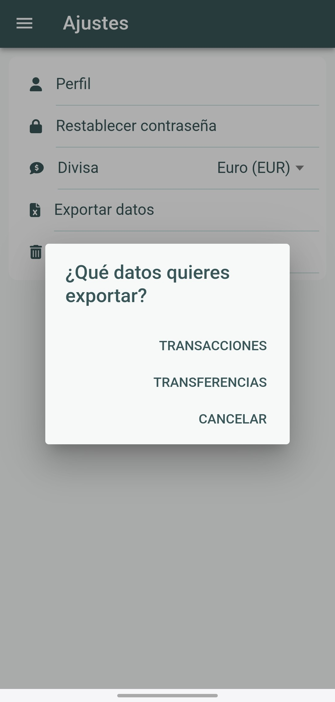
</p>

## Licencia

Este proyecto está licenciado bajo la MIT License.

## Contacto

Para cualquier consulta o sugerencia:

 - ✉️ Email: luciamengualr18@gmail.com

